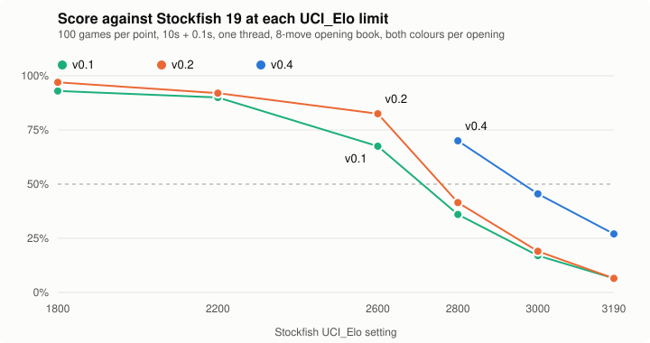
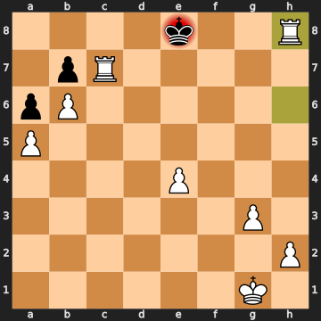

# Tempo

A chess engine written from scratch in C++20, with a neural-network evaluation trained on
its own games. It plays at about **2980 on Stockfish 19's strength-limited scale** and runs
live on Lichess as a BOT. Every strength change after the first version was kept or thrown
out based on measured games, not intuition.



### Highlights

- **Rated 2976 (95% CI 2933–3019)** against Stockfish 19's `UCI_Elo` levels, on one
  thread, up from 2688 for the first version. It beats Stockfish's 2800 setting 70% of
  the time and scores 27% against its maximum (3190).
- **NNUE evaluation trained end to end on my own data.** I generated 120M self-play
  positions, trained in PyTorch on an RTX 4090, and run the net with integer inference in
  C++. The first net won **+175 ± 32 Elo** against the hand-written eval; three more rounds
  of retraining added **+129**, **+113** and **+61** head to head, all accepted by SPRT.
- **Lazy SMP multithreading: +269 ± 65 Elo** at 8 threads vs 1, with the same code.
- **Move generation matches all 32 published perft counts** (610M nodes, 144M nodes/s) and
  a move-by-move diff against python-chess.
- **Live on Lichess** as [prospedplayer](https://lichess.org/@/prospedplayer) through the
  official `lichess-bot` bridge, rated around 2600 blitz against other bots.

**C++20 · CMake · Python · PyTorch · CUDA · fastchess · Stockfish (as a sparring partner) · lichess-bot**

## Overview

Tempo is an alpha-beta engine that speaks UCI, so it runs in any chess GUI, in match runners
like fastchess and cutechess, and on Lichess. Its evaluation is an NNUE ("efficiently
updatable neural network"), the design used by today's strongest engines, and I built the
whole pipeline: self-play data generation, training, quantization and integer
inference. The interesting part is the method. Correctness is pinned by perft and external
oracles, strength is measured against a fixed reference opponent, and each strength change after the
first version had to win games before it was kept. Several changes I expected to help, a
Texel-tuned evaluation and a larger network, lost games and were rejected (see below).

## Architecture

```
UCI loop (main.cpp) ──► Engine: N threads (Lazy SMP) ──► Search (search.cpp) ◄── shared TT (tt.h)
                                                          │ iterative deepening → PVS → quiescence
                                                          ▼
                       Position (position.cpp) ◄── bitboards / magic sliders (bitboard.cpp)
                          │ make/unmake, legality, SEE, Zobrist, NNUE accumulator
                          ▼
                       Evaluation: NNUE (nnue.cpp, default) or hand-written (eval.cpp)

Training loop:  tempo datagen ──► data/*.bin ──► tools/nnue/train.py (GPU) ──► src/nnue_weights.h
                                                        │
                                  verify.py (exactness) + SPRT vs previous net ──► ship or reject
```

## Engineering Highlights

### Neural-network evaluation (NNUE)

- **Architecture:** 768 inputs per side (colour × piece × square) feed a shared 256-unit
  feature transformer, one accumulator per side. The layer after that uses SCReLU and has
  a single output. The target blends the search score with the final game result.
- **Data generation (`tempo datagen`):** multithreaded self-play from random openings at
  5,000 nodes per move, recording quiet positions with their search score and final result
  in 32-byte records. It produces about 7,800 positions/s on 24 threads. `check_data.py`
  decodes a sample back into boards and requires every one to be legal.
- **Training (`tools/nnue/train.py`):** PyTorch on an RTX 4090 with EmbeddingBag sparse
  inputs, AdamW and cosine decay. Weights are exported as a quantized C++ header.
- **Inference (`src/nnue.cpp`):** pure integer arithmetic, with the first layer updated
  incrementally in make/unmake so an evaluation only computes the output layer. It
  searches as fast as the hand-written eval did (2.19M vs 2.00M nodes/s).
  `tools/nnue/verify.py` checks it three ways:

  | check | result on 300 random positions |
  |---|---|
  | engine vs a Python replica of its integer maths | identical on 300/300 |
  | incremental accumulator vs full rebuild | identical on 300/300 |
  | quantized vs float network | about 3 cp mean gap |

- **Iterated the data loop and gated every net by SPRT** (10s + 0.1s, one thread):

  | network | training data | result |
  |---|---|---|
  | net 1 vs hand-written eval | 13.9M positions (hand-written-eval self-play) | **+175 ± 32** (400 games) |
  | net 2 vs net 1 | same games, all 39.6M positions | **+129 ± 34**, SPRT accepted (264 games) |
  | net 3 vs net 2 | + 40M positions from net 1's own self-play | **+113 ± 28**, SPRT accepted (276 games) |
  | net 4 vs net 3 | + 40M positions from net 3's own self-play | **+61 ± 20**, SPRT accepted (402 games) |
  | 512-unit net vs net 2 | same as net 2 | **−45 ± 21**, SPRT rejected (530 games) |

  The 512-unit net had lower validation loss but evaluates at half the speed, and lost. The
  net 4 gain was real head to head, but it did not carry over to the Stockfish gauntlet
  (2976 vs 2989, well inside the error bars). Gains shrink as each round of self-play data
  looks more like the last. Net 4 ships because it won the direct comparison and is no
  worse against the outside reference.

### Search

- **Bitboard move generation.** Magic-bitboard sliders are found at startup by a seeded
  search, and a pin-aware legality check avoids make/unmake for most moves.
- **Principal-variation search** with:
  - a shared transposition table
  - iterative deepening and aspiration windows
  - pruning: null move, reverse futility, late-move reductions and pruning, SEE-based
    captures
  - move ordering: killer moves, butterfly history, and 1- and 2-ply continuation history
  - quiescence search
- **Lazy SMP.** Threads search the same root and cooperate through the shared hash table.
  At 8 threads it reaches 20.3M nodes/s vs 2.4M on 1, and **+269 ± 65 Elo** (100 games,
  65 W / 35 D / 0 L).
- **Time management fixed from a live Lichess game.** At 5+2 the engine spent 190s of its
  300s on the first 20 moves. It only checked its budget between iterations, and each
  iteration costs about twice the last. New iterations now start only in the first half of
  the budget, and no single move may use more than 1/8 of the clock. A simulated 5+2 game
  keeps 160s after 60 moves.

### Measurement

- **Strength is measured against a fixed reference.** Each release plays 100 games per
  level against Stockfish 19's `UCI_Elo` limits, with both colours of every opening from an
  8-move book. `tools/fit_rating.py` fits a single rating by maximum likelihood with a 95%
  confidence interval.
- **Changes are gated by head-to-head matches and SPRT** through fastchess:
  - Hand-written eval terms: **+94 ± 28**.
  - Continuation history: **+7.9 ± 6.6** over 4,000 games. The SPRT's log-likelihood ratio
    reached 2.61 of the 2.94 needed to formally accept.
- **Rejected a Texel-tuned evaluation because it lost games.** The multithreaded Adam tuner
  (`tools/tune.cpp`) fits all 475 hand-written eval parameters. It cut held-out MSE from
  0.0783 to 0.0743, but every tuned build played worse:
  - −41 vs v0.1
  - −105 vs the hand-set eval, with rare features frozen
  - −139 vs the hand-set eval, with rare features and material frozen

  All three were 400-game matches.

<details>
<summary>Sample game: Tempo mates Stockfish 19 (UCI_Elo 2800) with two rooks</summary>



Full game (v0.2): [`docs/mate_vs_sf2800.pgn`](docs/mate_vs_sf2800.pgn)
</details>

## Results

Score against Stockfish 19, 100 games per level, 10s + 0.1s, one thread:

| Stockfish `UCI_Elo` | v0.1 (PeSTO eval) | v0.2 (hand-written eval) | v0.3 (NNUE net 3) | v0.4 (NNUE net 4) |
|---|---|---|---|---|
| 1800 | 93.0% | 97.0% | | |
| 2200 | 90.0% | 92.0% | | |
| 2600 | 67.5% | 82.5% | | |
| 2800 | 36.0% | 41.5% | 70.0% | 70.0% |
| 3000 | 17.0% | 19.0% | 43.5% | 45.5% |
| 3190 (max) | 6.5% | 6.5% | 33.5% | 27.0% |
| **fitted rating** | **2688** (2647–2728) | **2758** (2718–2797) | **2989** (2946–3031) | **2976** (2933–3019) |

v0.3 and v0.4 were only run at the three top levels, where results are informative. All
1,800 games ended normally: no illegal moves, crashes or time forfeits. These ratings sit on
Stockfish's own `UCI_Elo` scale at a fast time control. They are not a CCRL or Lichess
rating.

**On Lichess** ([prospedplayer](https://lichess.org/@/prospedplayer), live since
2026-09-27) it plays rated games against other bots at around 2600 blitz; the profile has the
current rating and every game. The deployed bot runs v0.4 on 8 threads. It also takes early
moves from the Lichess masters database and uses the 7-piece tablebases. Those are external
lookups; the engine's own search plays everything in between.

## Getting Started

Needs CMake 3.20+, Ninja and GCC with C++20 support. The trained network ships in the
repo (`src/nnue_weights.h`, about 0.9 MB), so no download is needed. Built and tested with
GCC 16.2 (mingw-w64, Windows) and GCC 13.3 (Ubuntu 24.04). On both, `perft.py --deep` and
`test_engine.py` pass and `bench` gives the same node count. On Windows use a MinGW-w64 GCC
(for example w64devkit or MSYS2); the build uses GCC flags, so MSVC is not supported.

```sh
git clone https://github.com/ethanstoner/tempo-chess.git
cd tempo-chess
cmake -S . -B build -G Ninja
cmake --build build
./build/tempo            # UCI engine; options: Threads, Hash, UseNNUE, Move Overhead
./build/tempo bench      # fixed-depth search signature + nodes/s
```

The build tunes for the local CPU (`-march=native`). For a binary to copy to another
machine, configure with `-DTEMPO_NATIVE=OFF`.

Training a network (needs PyTorch and NumPy; CUDA recommended):

```sh
./build/tempo datagen data/gen.bin 40000000 24 5000 nnue   # positions, threads, nodes/move
python tools/nnue/train.py data/gen.bin --hidden 256 --epochs 20 --out src/nnue_weights.h
cmake --build build                                        # rebuild with the new net
python tools/nnue/verify.py src/nnue_weights.h.pt build/tempo   # build/tempo.exe on Windows
```

### Running it on Lichess

Needs a fresh Lichess account that has never played a game and an API token with the
`bot:play` scope. The token is read only from the `LICHESS_BOT_TOKEN` environment variable;
`deploy/config.yml` holds a placeholder and never the real token. The scripts clone the
official `lichess-bot` into `deploy/lichess-bot/` and set up a Python venv on first run.

Windows (PowerShell):

```powershell
$env:LICHESS_BOT_TOKEN = "lip_..."
.\deploy\run.ps1 -Upgrade   # once: converts the account to a BOT (irreversible)
.\deploy\run.ps1
```

Linux / macOS:

```sh
export LICHESS_BOT_TOKEN=lip_...
./deploy/run.sh -u          # once: converts the account to a BOT (irreversible)
./deploy/run.sh
```

## Testing

The Python tests need `python-chess` and run against `build/tempo`:

```sh
pip install chess
python tests/perft.py --deep     # 32 published perft counts + 200-position python-chess diff
python tests/test_engine.py      # Zobrist, eval symmetry, 13 forced mates, UCI stop, time use
```

Two more checks need extra setup:

- `tools/nnue/verify.py` (NNUE exactness vs integer replica, incremental vs rebuilt) needs
  the `.pt` checkpoint that `train.py` writes next to the header. Only the header is
  committed, so run it after training a net.
- `deploy/test_lichess.ps1` (Windows PowerShell) plays a full game through lichess-bot's
  mocked lichess.org. It needs no account or token.

`test_engine.py` covers four areas, and runs with the NNUE on:

- **Zobrist:** the incremental hash equals a from-scratch hash after 300 random move
  sequences.
- **Eval symmetry:** each of 300 random positions scores the same as its colour-flipped
  mirror.
- **Forced mates:** 13 positions labelled by Stockfish at depth 30. Mates up to mate in 4
  must be found at the exact length.
- **UCI protocol:** `stop` returns within 200 ms, and a 1-second clock is not overspent.

Reproducing the strength numbers needs three external files in `tools/`, none of them in
this repository: a [fastchess](https://github.com/Disservin/fastchess) binary, a
[Stockfish](https://stockfishchess.org/download/) binary (named `fastchess` and `stockfish`,
plus `.exe` on Windows) and the `8moves_v3.pgn` opening book from
[official-stockfish/books](https://github.com/official-stockfish/books):

```sh
python tools/match.py gauntlet --levels 2800 3000 3190 --games 100 --tag mine
python tools/fit_rating.py mine
```

## What I Learned

- **Loss curves don't pick engines; games do.** Twice a lower-loss model lost: the Texel-tuned
  eval (−41 to −139 Elo) and the 512-unit network (−45). Net 2's validation loss was
  almost identical to net 1's, yet it won by 129 Elo.
- **The data loop compounds, then flattens.** Training on the previous network's own games
  was worth +113 Elo, then +61 head to head. The +61 didn't show against Stockfish, so
  self-play alone overstates late gains. An outside reference is what catches that.
- **Deployment finds bugs tests don't.** A time-management flaw that every offline test
  missed showed up in the first real blitz game, where the engine was down to 28 seconds
  against its opponent's two minutes.
- **Test data needs its own checks.** A hand-written bench position was illegal and several
  "mate in N" puzzles were really mate in 1. External oracles caught both.

## Credits

The hand-written eval's starting piece-square tables and material values are PeSTO's (Ronald
Friederich, via the Chess Programming Wiki). `lichess-bot`, fastchess, Stockfish and the
8-move opening book are external projects downloaded at setup, not vendored.

## License

MIT, see [LICENSE](LICENSE). The external tools above keep their own licenses and are not
part of this repository.
